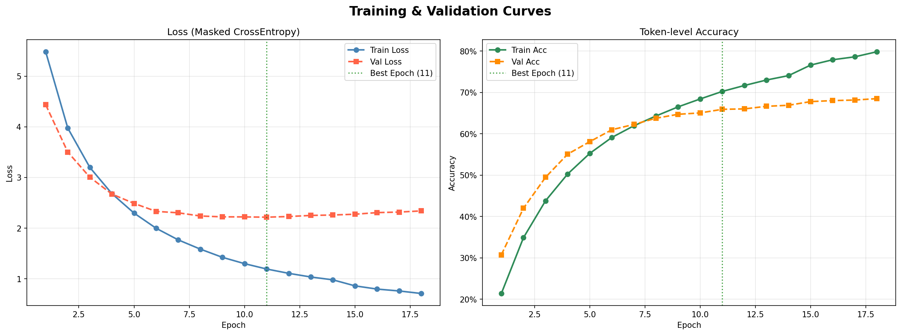
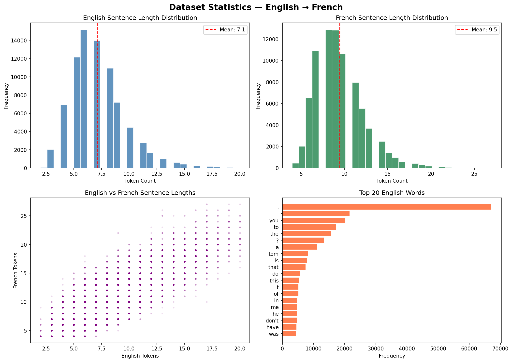
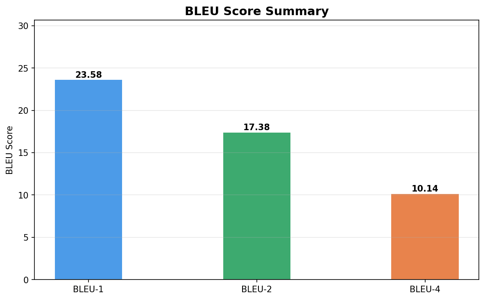
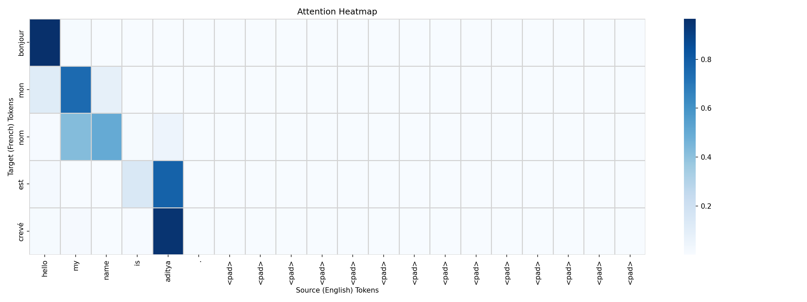

# English → French Neural Machine Translation

## 🧠 Neural Machine Translation (NMT) – English to French Translator

This project is a Neural Machine Translation (NMT) system that translates English sentences into French using a Sequence-to-Sequence (Seq2Seq) architecture with Bahdanau Attention Mechanism and Beam Search Decoding. The model is built using TensorFlow and deployed using Hugging Face Spaces with a Gradio interface.

Live Demo:- [](https://huggingface.co/spaces/AdiKr25/NMT_Eng-to-French_Seq2Seq_Bahdanau_Attention)


## 📓 Training Notebook

The full model training pipeline can be found here:

[Open Notebook](notebook/nlp.ipynb)

## Dataset

The model was trained using the **Tatoeba English–French parallel dataset**
from the ManyThings.org collection.

### Dataset Source:
https://www.manythings.org/anki/

The dataset contains sentence pairs extracted from the
Tatoeba Project, where each line consists of:

English Sentence  →  French Sentence

For this project:

• Total pairs used: 80,000  
• Max English length: 20 tokens  
• Max French length: 25 tokens

It simulates how real-world translation systems like Google Translate work — encoding a sentence in one language and decoding it into another using deep learning.

## 🚀 Project Overview

Language translation is one of the most fascinating tasks in Natural Language Processing (NLP). Traditional approaches like rule-based systems or statistical translation models fail to capture the contextual meaning of sentences. This project overcomes those limitations by implementing a deep learning–based neural translation system.

The model follows an Encoder–Decoder architecture where the Encoder reads and encodes the English sentence into a fixed-length vector representation, and the Decoder generates the French translation word by word.

To further improve translation quality, the model uses an Attention mechanism, allowing it to focus on specific parts of the input sentence when predicting each word.

Additionally, Beam Search decoding is used during inference to explore multiple translation possibilities simultaneously, resulting in smoother, more accurate translations compared to simple greedy decoding.

## 🧩 Model Architecture

The architecture of this project is divided into three key parts — Encoder, Attention, and Decoder:

### Encoder:

The Encoder is a Bidirectional GRU network that reads the English sentence and converts it into context representations. It captures both forward and backward dependencies, which helps understand the full meaning of the input sequence.

### Bahdanau Attention:

The Attention mechanism computes a weighted sum of the encoder outputs for every decoder time step. This allows the model to focus on the most relevant parts of the input sentence while generating each French word.

### Decoder:

The Decoder is also a GRU network that uses the context vector from the attention mechanism along with the previously predicted tokens to generate the French translation.

### 🔍 Beam Search in Translation

During inference, a Beam Search algorithm is applied instead of greedy decoding.
While greedy decoding only selects the single most probable word at each step, Beam Search keeps track of the top k most probable sequences (beams).

For every new predicted word, the algorithm expands all current beams and selects the k best-scoring partial translations. This process continues until an <end> token is predicted or the maximum sequence length is reached.

Beam Search improves translation quality by keeping the top-k most probable translation sequences instead of selecting only the best token at each step.

## ⚙️ Backend – Hugging Face

The backend is built using Hugging Face, open source AI platform and community for dataset,model. 

Used Hugging Face Space for repo with all .py,.pkl file.

Hugging Face Model Hub for deployment of saved keras model file.

The backend workflow is as follows:

- Hugging Face Spaces installs dependencies from requirements.txt
- app.py is executed as the application entry point
- Tokenizers and configuration files are loaded
- The trained model is downloaded from Hugging Face Model Hub
- Input sentences are preprocessed and passed through the encoder–decoder model
- Beam Search generates the final translation

## 🎨 Frontend – Gradio

Gradio is an open-source Python library used to build interactive web interfaces for machine learning models.

The frontend is a simple yet clean user interface . It contains a text box where the user can enter a English sentence, a “Translate” button to send the request, and an output section to display the translated French sentence.

## 🧠 Training and Model Files

The model was trained on an English-French parallel corpus, preprocessed with tokenization, padding, and word indexing using Keras Tokenizer. The training process involved:

Converting sentences into numerical sequences.

Padding them to uniform length.

Using Teacher Forcing to guide the decoder during training.

Optimizing with the Adam optimizer and Sparse Categorical Crossentropy loss.

After training, the trained artifacts saved as:

- eng_tokenizer.pkl
- config.pkl
- fra_tokenizer.pkl

The trained model was saved as:

- nmt_model_full.keras

## 🔍 Example Translation

EN: Hello, how are you?

FR: écoutez comment vous êtes

EN: I love Paris in the spring.

FR: j'aime voyager sur le printemps

EN: Can you speak more slowly please?

FR: peux tu parler plus lentement s'il vous plaît

EN: She is reading a book.

FR: elle lit un livre


## Results:


## 📊 Training Results

### Training Curves


### Dataset Statistics


### BLEU Scores


### Attention Visualization


## 🧰 Folder Structure

```bash
nmt-english-french/
│
├── app.py                  # Gradio app (Spaces entry point)
├── model_architecture.py   # Encoder, Decoder, Attention classes
├── requirements.txt        # Python dependencies
├── README.md               # Project description
│
├── config.pkl              # Model config
├── eng_tokenizer.pkl       # English tokenizer
├── fra_tokenizer.pkl       # French tokenizer
│ 
├── notebook/
│   └── nlp.ipynb           # Training notebook
│
├── images/
│   ├── training_curves.png
│   ├── dataset_statistics.png
│   ├── performance_summary.png
│   ├── bleu_scores.png
│   └── attention_heatmap.png
```

## 🧪 How to Run the Project

### Clone the repository:

```bash
git clone https://github.com/yourusername/NMT-Eng-to-French-Seq2Seq-Bahdanau-Attention.git

cd nmt-translator
```

### Create and activate a virtual environment:

```bash
venv\Scripts\activate  # for Windows

source venv/bin/activate  # for Mac/Linux
```

### Install dependencies:

```bash
pip install -r requirements.txt
```

### Run the application:

```bash
python app.py
```

After starting, Gradio will generate a local URL (usually):

http://127.0.0.1:7860

Open the link in your browser, enter an English sentence, and the model will generate the French translation along with the attention heatmap.

## 🔬 Future Improvements

- Replace Seq2Seq with Transformer architecture
- Train on larger datasets like WMT14
- Use Subword tokenization (BPE or SentencePiece)
- Add multilingual translation support
- Improve inference speed with optimized decoding
